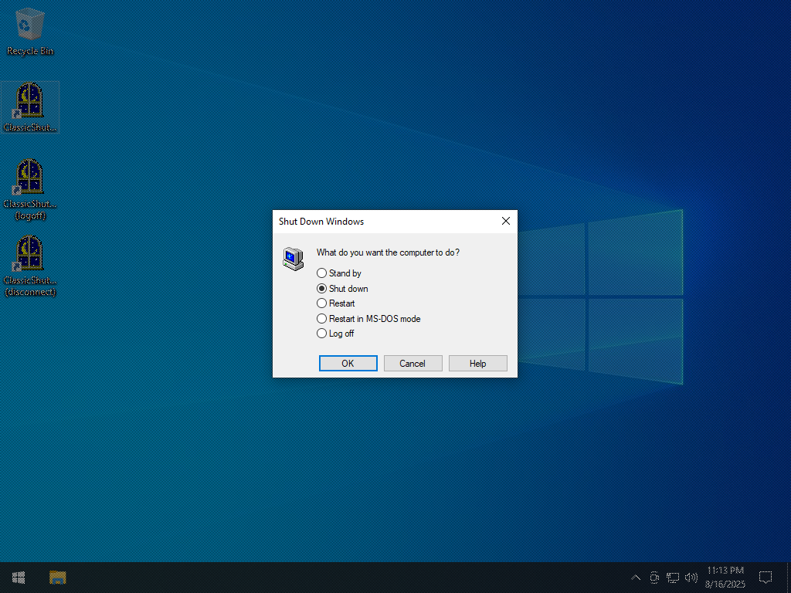
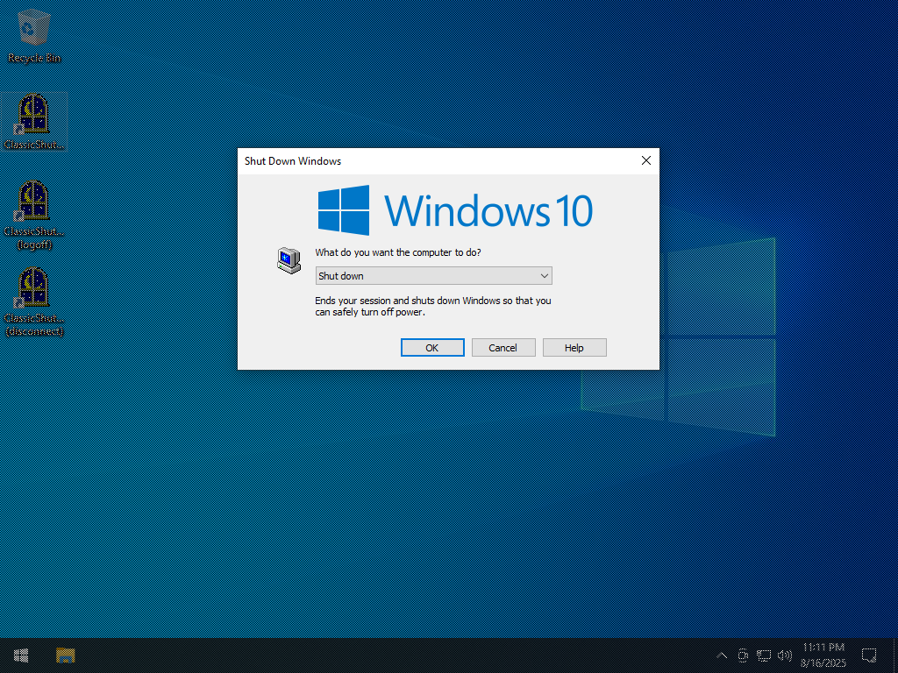
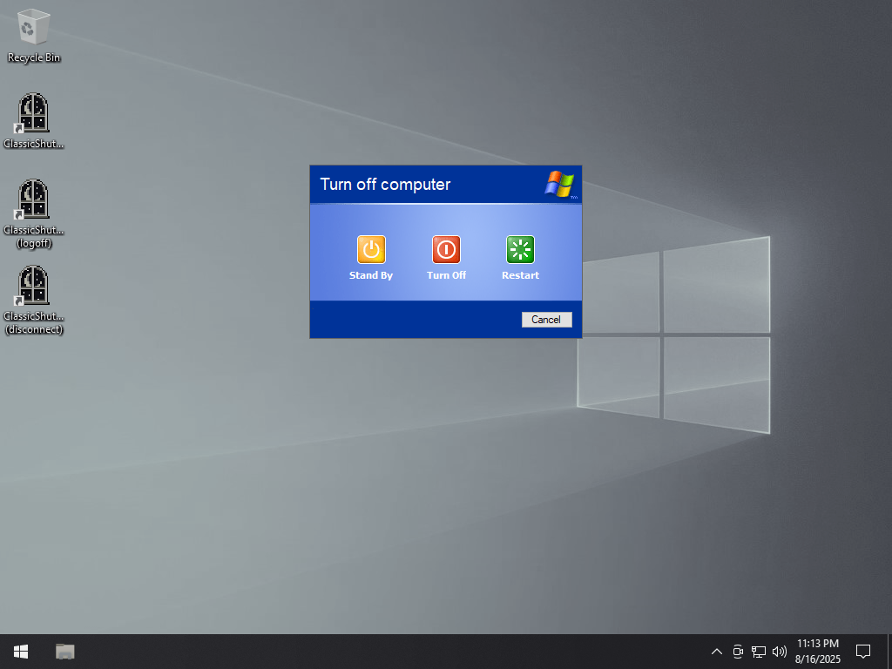
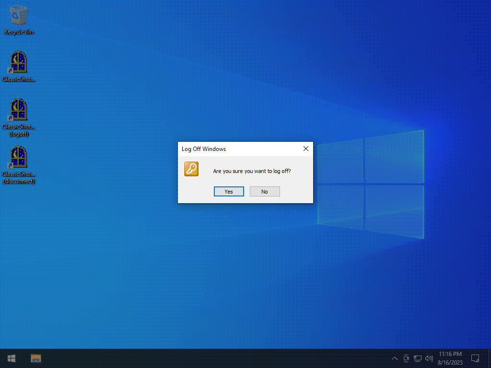
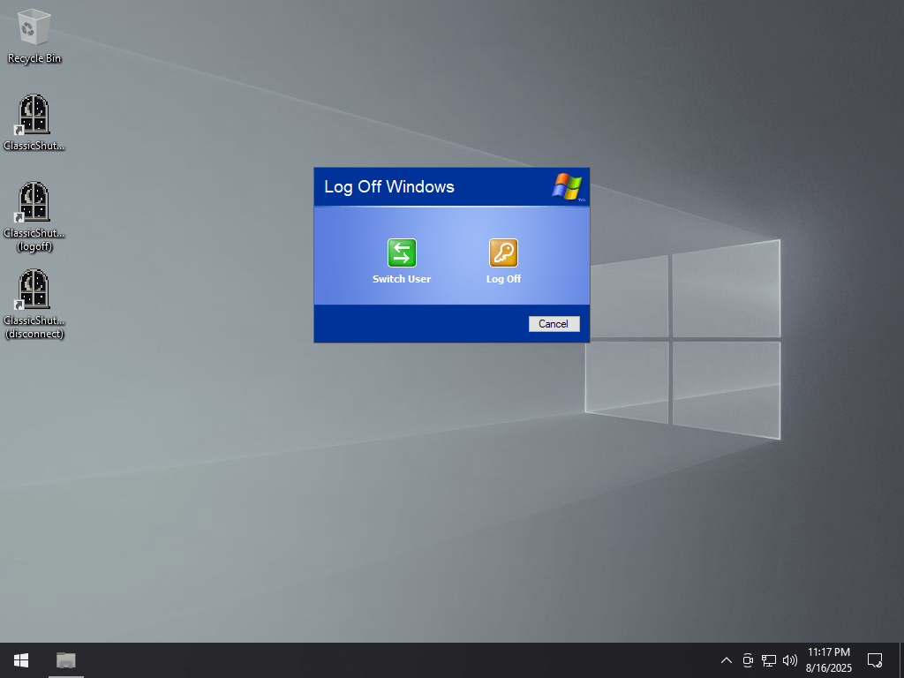
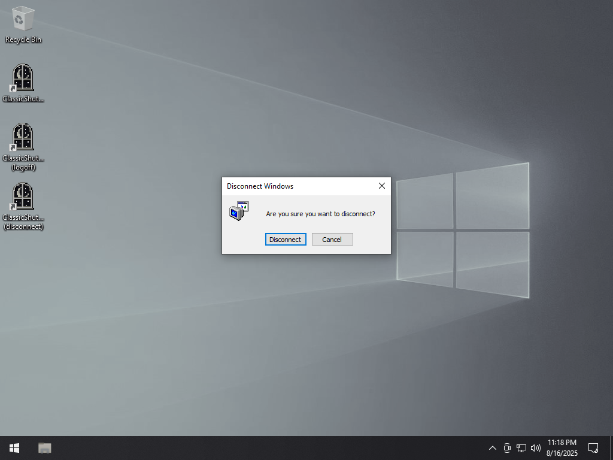

# ClassicShutdown
ClassicShutdown is a recreation of various shutdown/log off dialogs from older Windows versions.

## Features
- Styles ranging from Windows 95 to XP
- Select which options to display
- Custom banner images
- MUI localization
- Built as a DLL for use in external applications

## Usage
To display the logoff dialog, pass `/logoff` in the command line arguments. To display the disconnect
dialog, pass `/disconnect` in the command line arguments. To change the shutdown and log off styles,
run `ClassicShutdownConfig.exe`. For extended command line arguments, run `ClassicShutdown.exe /?`.

## API documentation
For API documentation, see the [wiki](https://github.com/aubymori/ClassicShutdown/wiki).

## Screenshots

|  |  |  |
|-|-|-|
|  |  |  |