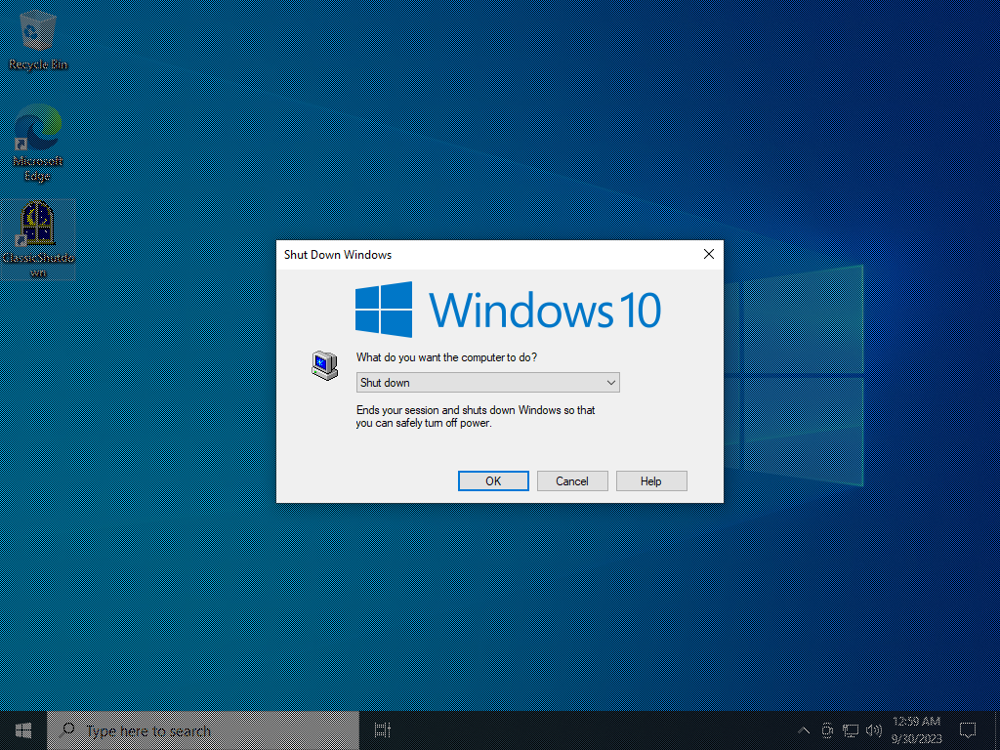
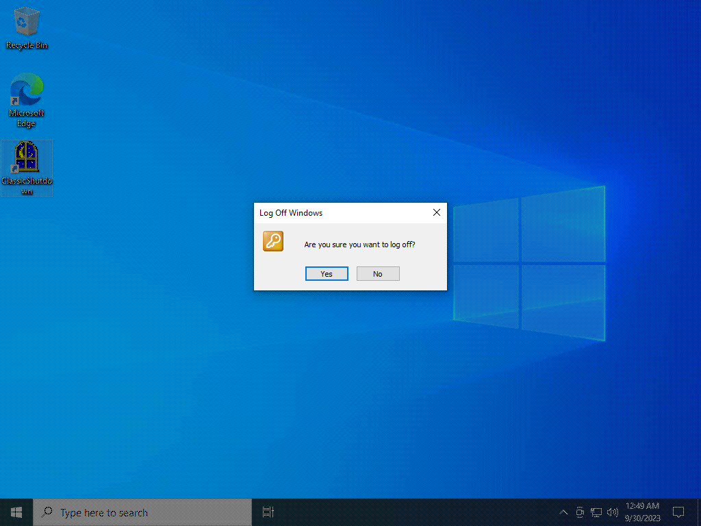
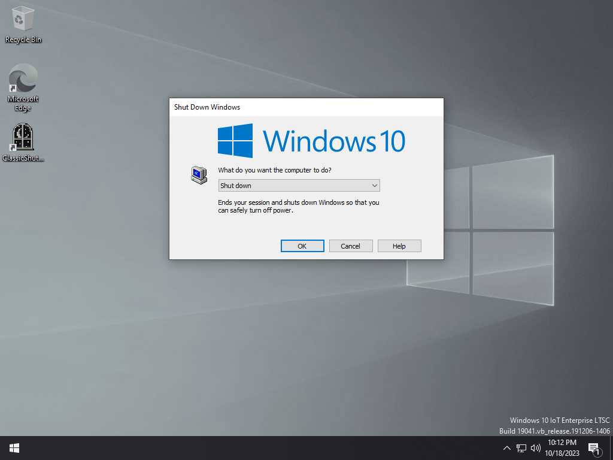
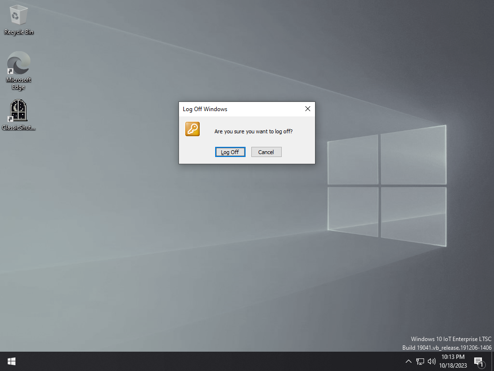
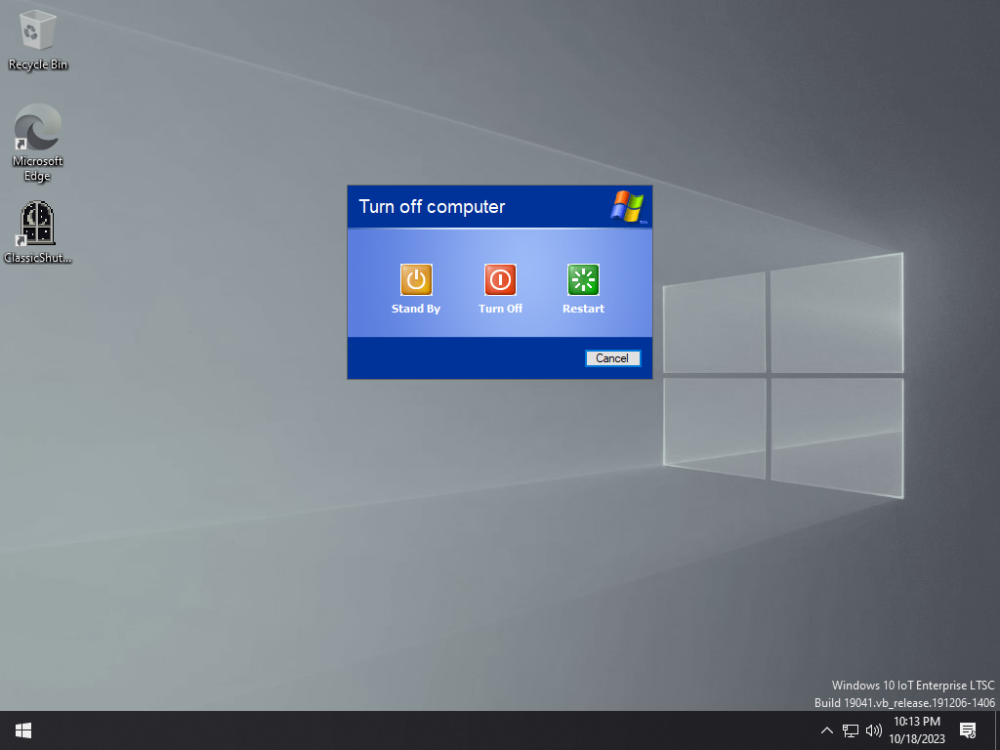
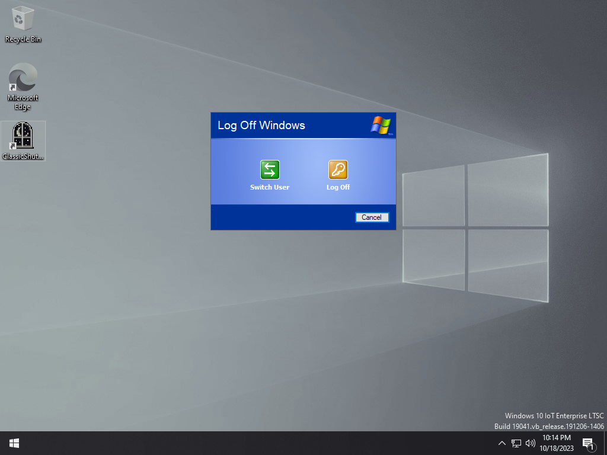

# ClassicShutdown
ClassicShutdown brings the shutdown dialog from Windows 2000 and Windows XP to modern versions of Windows.

## Usage

These are the **command line arguments** for ClassicShutdown. You pass these in the **Command Prompt** or use something like my [Custom Shutdown Dialog](https://windhawk.net/mods/custom-shutdown-dialog) Windhawk mod.

<small>~~I am surprised at how many of you don't understand the basic concept of command line arguments.~~</small>

```
ClassicShutdown.exe [/logoff] [/lang lang] [/style classic | xpclassic | xp]
```

## `/logoff`

Displays the logoff confirmation dialog.

## `/lang`

Specifies the language to use (e.g. `en-US`, `ja-JP`).

## `/style`

Specifies which style of shutdown screen to use.

### `classic`

Windows 2000 style This is the default if a style is not specified.




### `xpclassic`

Windows XP with Welcome screen disabled style.




### `xp`

Windows XP style.


