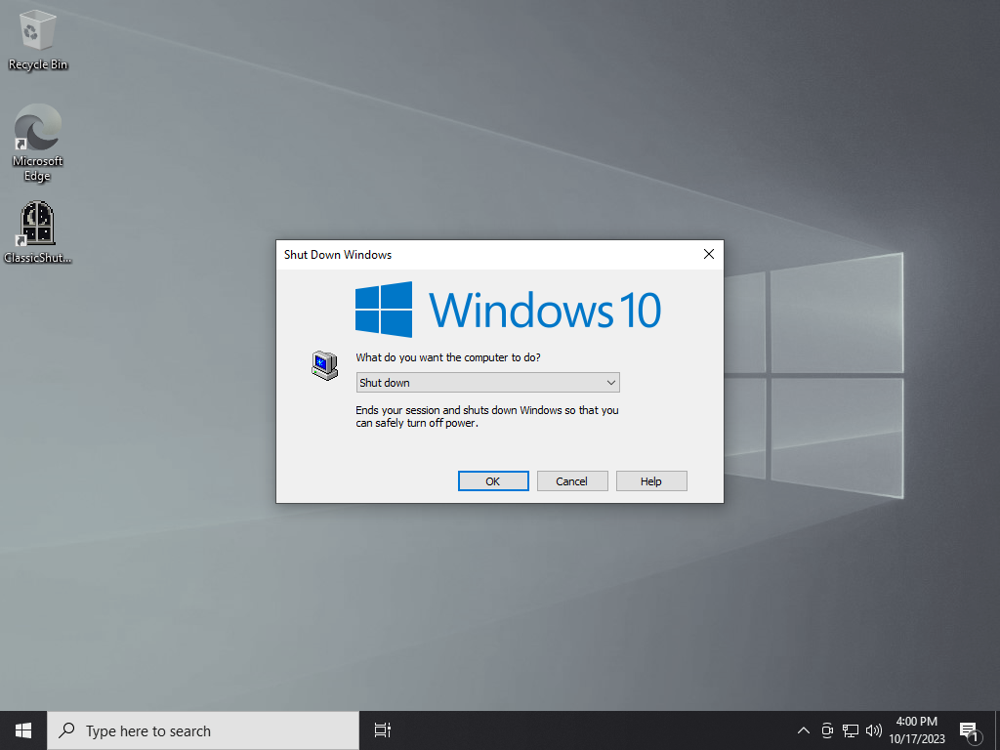

# ClassicShutdown
ClassicShutdown brings the shutdown dialog from Windows 2000 to modern versions of Windows, dither effect and all!

## Preview


## Usage

```
classicshutdown [/logoff] [/noclose] [/xpdim]
```

### `/logoff`

Displays the logoff confirmation dialog.


### `/noclose`

Does not display a close button on the shutdown dialog, like Windows XP.


### `/xpdim`

Fades the screen to black and white like Windows XP rather than applying a dither effect like 2000.

